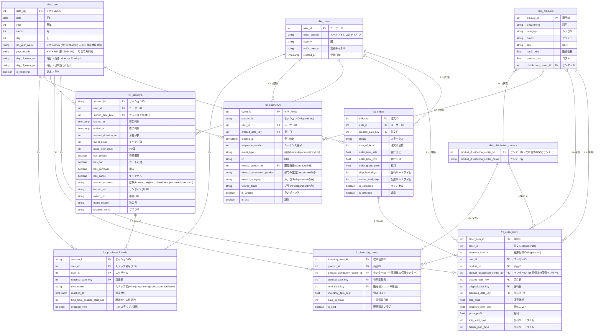

# TheLook eCommerce データモデリング設計

## 1. アーキテクチャ

本プロジェクトでは dbt を用いて raw データを分析用のスタースキーマに変換する。
データ構造は Fact / Dimension に分けてモデリングする。

## 2. テーブル分類

### Dimension

主に「いつ・誰が・何を・どこで」を表すマスター。

* **`dim_date`**: 日付ディメンション。全 Fact が共通で参照する横串軸
* **`dim_users`**: 顧客の属性情報（生データ: `users.csv`）
* **`dim_products`**: 商品のカタログ情報（生データ: `products.csv`）。商品階層（`department > category > brand`）を持つ
* **`dim_distribution_centers`**: 物流センターの情報（生データ: `distribution_centers.csv`）

### Fact

イベント・トランザクション・行動を表す事実。粒度ごとに分離する。

#### 注文系

* **`fct_orders`**: 注文単位の事実（粒度: 1 注文）。**注文単位の KPI**（AOV、キャンセル率、配送リードタイム等）を扱う（生データ: `orders.csv` + `order_items.csv` 集計）
* **`fct_order_items`**: 注文明細単位の事実（粒度: 1 明細）。**売上分析の最小単位**で、粗利・販売価格・販売リードタイムを持つ（生データ: `order_items.csv`, `inventory_items.csv`）

#### 在庫系

* **`fct_inventory_items`**: 在庫個体単位の事実（粒度: 1 個体）。**販売済み・未販売の両方を含む**ため、在庫滞留日数・未販売個体数・在庫回転を扱える（生データ: `inventory_items.csv`）

#### Web 行動系

* **`fct_pageviews`**: ページ閲覧 1 件粒度。`event_type IN ('home', 'department', 'product')` のみを抽出し、`uri` から `product_id` / `gender` / `category` / `brand` を派生（生データ: `events.csv`）
* **`fct_sessions`**: セッション 1 件粒度。ファネル進捗フラグ・初回到達時刻・流入元・滞在時間・離脱地点を 1 行に集約。**Web 行動分析の中心 Fact**（生データ: `events.csv`）
* **`fct_purchase_funnels`**: セッション × ファネルステップ粒度（最大 5 ステップ）。BI ツール上のファネル可視化に直結（生データ: `events.csv`）

---

## 3. レイヤー構成

dbt の標準構成に intermediate を加えた 4 層構成を採用する。

| レイヤー | ディレクトリ | 役割 | マテリアライゼーション |
| --- | --- | --- | --- |
| Source | （`_staging__sources.yml` で参照） | raw CSV を dbt の source として宣言する層 | - |
| Staging | `models/staging/` | 1 raw テーブル ⇄ 1 stg モデルで、軽微なクレンジングのみ行う | view |
| Intermediate | `models/intermediate/` | Mart を組み立てる中間集計（セッション化、ファネル到達計算、uri パースなど） | view (or ephemeral) |
| Mart | `models/marts/` | dim / fct に再構成し、分析に直接使える形にする | table |

### Intermediate 層の代表モデル例

実装時の見取り図として代表的な intermediate モデルを列挙する（命名・粒度は実装時に調整可）。

| モデル名 | 役割 | 主に組み立てる Mart |
| --- | --- | --- |
| `int_events_uri_parsed` | `stg_events` の `uri` をパースし、`viewed_product_id` / `viewed_department_gender` / `viewed_category` / `viewed_brand` を付与 | `fct_pageviews` |
| `int_sessions` | `session_id` 単位で集計（`event_count`, `started_at`, `ended_at`, ファネル進捗フラグ等） | `fct_sessions` |
| `int_funnel_steps` | 各セッションが各ファネルステップにいつ到達したかを判定 | `fct_purchase_funnels` |
| `int_order_items_with_cost` | `stg_order_items` に `stg_inventory_items.inventory_item_cost` を結合 | `fct_order_items` |
| `int_orders_aggregated` | 明細を注文単位に集計（合計売上・粗利・リードタイム等） | `fct_orders` |

後述の ER 図は Mart 層の論理モデルを示す。Staging 層は raw を整えるだけの中間層であり、ER 図には現れない。

---

## 4. Staging 層の方針

Staging 層は raw と 1:1 を原則とする。

### 4.1 スコープ

#### やること

* カラムのリネーム（`id` → `<entity>_id` など、Mart 層と整合する命名へ）
* 型のキャスト（特にタイムスタンプ）
* 軽微なクレンジング（trim、表記ゆれ正規化、明らかな NULL 補完）
* 重複排除（自然キー単位で最新行を残す）
* 分析に不要な列のドロップ（PII・冗長列など）

#### やらないこと

* テーブル間の JOIN（→ Intermediate / Mart 層）
* 集計・サマリ作成（→ Intermediate / Mart 層）
* ビジネスロジック・KPI 計算（→ Mart 層）

### 4.2 命名規則

* モデル名: `stg_<table>`（raw テーブル名と 1:1 対応）
* 主キー: `id` → `<entity>_id` にリネーム（例: `users.id` → `user_id`）
* タイムスタンプ列: `_at` サフィックスを付ける（例: `created_at`）

### 4.3 テスト（`_staging__models.yml`）

最低限、各 stg モデルの主キーに以下の dbt test を付与する。

* `unique`
* `not_null`

同一メールアドレスで登録しているユーザーは最新のアカウントを優先する。
この処理については議論の余地あり。

---

## 5. Mart 層の ER 図

以下は Mart 層のスタースキーマの論理リレーション図。dbt でこのモデルに沿って raw を変換し、BI ツールでダッシュボードを構築する。

---

## 6. BI 分析軸との対応

本データモデルは以下 5 テーマの BI ダッシュボードを想定している。各テーマが主に参照する Fact / Dim を次表にまとめる。

| テーマ | 主要 KPI の例 | 参照する Fact | 主なディメンション |
| --- | --- | --- | --- |
| A. 売上 / 収益 | GMV、AOV、粗利、値引き率 | `fct_order_items`（明細）/ `fct_orders`（注文） | `dim_users` / `dim_products` / `dim_distribution_centers` / `dim_date` |
| B. 顧客 | 新規/リピート、コホート、LTV、RFM、獲得チャネル別購買 | `fct_order_items` + `dim_users.traffic_source` | `dim_users` / `dim_date` |
| C. 商品 / 在庫 | 売れ筋/死筋、在庫滞留日数、未販売個体数、在庫回転 | `fct_order_items` + `fct_inventory_items` | `dim_products` / `dim_distribution_centers` / `dim_date` |
| D. オペレーション | キャンセル率、返品率、配送リードタイム、センター別出荷効率 | `fct_orders` / `fct_order_items` | `dim_distribution_centers` / `dim_date` |
| E. Web 行動 | DAU/WAU/MAU、セッション数、CVR、ファネル離脱、商品閲覧ランキング | `fct_sessions` / `fct_pageviews` / `fct_purchase_funnels` | `dim_users` / `dim_products` / `dim_date` |

---

## 7. 設計上の決定事項と注意点

### 7.1 粗利のコスト

`fct_order_items.gross_profit = sale_price - inventory_item_cost`。**個体コスト**（`stg_inventory_items.inventory_item_cost`）を使う。商品マスタの `products.cost`（平均コスト）は仕入れ時期で変動するため使わない。

### 7.1.1 `fct_inventory_items.days_in_stock` の基準時点 (as_of)

未販売個体の在庫滞留日数は「いつ時点で何日経っているか」を決めないと計算できない。`current_timestamp` / `current_date` で実行時刻を使うと、dbt run の実行時刻に依存して結果が毎日変わる（再現性が無い）うえ、raw のスナップショットが古い場合（本プロジェクトでは raw の最終観測が 2024-01-21、ある時点では `current_date` は 2026 年）に実態とかけ離れた値（平均 4.3 年滞留など）になる。

そのため `days_in_stock` は **raw の最終観測時点 (`greatest(max(created_at), max(sold_at))`) を as_of** として算出する方針に揃える。

* 売却済（`is_sold=true`）: `sold_at - created_at`（raw に確定値）
* 未売却（`is_sold=false`）: `as_of - created_at`（dbt 側で導出）

これにより、同じ raw に対しては dbt run のたびに同じ結果が返る。raw が更新（追記）されると as_of が前進し、未売却個体の `days_in_stock` も自然に追従する。「特定時点の在庫スナップショットを再現したい」要件が出た段階で、`var('inventory_as_of_date')` を追加して上書き可能にする拡張余地を残す。

### 7.2 SCD Type 1 で運用

`dim_users` などのディメンションは **Type 1（最新で上書き）**。raw に履歴がないため Type 2 は不可。「購入時点の国」のような時点属性が必要なら、Fact 側にスナップショット列として持つ（例: `fct_order_items.user_country_at_purchase`）。

### 7.3 `purchase` イベント ≠ 注文

実データでは **`event_type='purchase'` のイベント数（181,759）と `orders` 件数（125,226）が一致しない**。Web 行動 Fact 系（`fct_sessions` / `fct_pageviews` / `fct_purchase_funnels`）と注文 Fact 系（`fct_orders` / `fct_order_items`）は **直接 JOIN しない**。両者は `dim_users` と `dim_date` を共有する別軸の Fact として扱う。

### 7.4 `uri` からの派生

`fct_pageviews` の派生情報は intermediate 層で `uri` をパースして埋める。

* `^/product/(\d+)` → `viewed_product_id`
* `^/department/([^/]+)/category/([^/]+)/brand/([^/]+)` → `viewed_department_gender / viewed_category / viewed_brand`

実データで `/product/{id}` のパターンマッチは全件成功を確認済み（845,607 / 845,607）。

### 7.5 セッションの定義と前提

#### セッション ID の扱い

`stg_events.session_id` は **raw 側で振られた ID をそのまま使う**（dbt 側で再セッション化はしない）。GA 等の一般的な Web 解析と同様、アプリ側のトラッキング SDK が「30 分間新たなイベントがなければセッション終了」というタイムアウトでセッションを区切る前提とする。dbt 側で別のタイムアウトを実装すると raw とずれた二重定義になるため避ける。

将来 raw に未セッション化のイベントログが入る場合は、`int_events_uri_parsed` の前段に `int_events_sessionized` を新設して再セッション化する（現状は不要）。

#### セッション内容の前提

実データでは **全セッションが必ず `event_type='product'` を含む**（681,759 / 681,759）。`fct_sessions` の中心は商品閲覧であり、`home` などは補助的な属性扱い。

#### セッションのユーザー識別の前提

raw の events は未ログイン状態を多く含み、`fct_sessions.user_id` の **約 73% が unknown member（user_id = -1）** に集約される（実データで `unknown 73.3% / registered 22.4% / inferred 4.3%`）。`fct_pageviews` でも約半分（`unknown 49.0%`）が unknown。一方で `fct_orders / fct_order_items` には unknown は 0 で、registered + inferred で完全網羅される（注文には raw 側で必ず user_id が振られているため）。

このため Web 行動 Fact 系の DAU/WAU/MAU を `count(distinct user_id)` で素朴に算出すると **unknown を 1 ユーザーと数えてしまう過小推定**になる。BI 側では明示的に `where user_type != 'unknown'` でフィルタするか、unknown を別系列として可視化する。詳細は 7.9 節を参照。

### 7.6 行動マーカーの扱い

`event_type IN ('cart', 'purchase', 'cancel')` は uri が固定文字列で派生情報を持たないため、**独立 Fact にはしない**。`fct_sessions` のフラグ列・初回時刻列に集約する。

### 7.7 ファネルステップ定義

`fct_purchase_funnels` のステップは購買プロセスに沿って次の 5 段階に固定する。

| step_no | step_name |
| --- | --- |
| 1 | home |
| 2 | department |
| 3 | product |
| 4 | cart |
| 5 | purchase |

到達したステップのみ行を持つ（最大 5 行 / セッション）。`dropped_here = (次のステップに到達していない)` で計算する。

#### 同一ステップを複数回踏んだ場合

1 セッション内で同じステップを複数回踏むケース（例: `product` を 3 回閲覧、`cart` に 2 回追加）は普通に起こる。`fct_purchase_funnels` では **各 `(session_id, step_no)` に 1 行のみ** とし、`reached_at` には **最初の到達時刻** を採用する。

採用理由:

* `time_from_session_start_sec` が step_no に対して単調増加になる
* ファネル分析で「いつカートに到達したか」は通常初回時刻を指す

#### 最終ステップ (`purchase`) の `dropped_here`

最終ステップに到達したセッションは完走とみなし、`dropped_here = false` とする（`purchase` での `dropped_here = true` は仕様上発生しない）。

### 7.8 `dim_date` の採用

`dim_date` の採用は「Kimball 流のベストプラクティスに従う」か「データ重複を避けてシンプル化する」かの選択になる。本プロジェクトでは **採用** を選択した。

採用理由:

* **dbt の練習価値**: 日付ディメンションの生成は dbt 学習の典型題材
* **将来の拡張点**: 祝日マスタ・会計年度・セール期間など組織固有のカレンダーを追加する際の集約場所として使える
* BI ツール間の差異（週始まり曜日、ISO 週番号など）を吸収できる

一方、TheLook データ単体では実利は薄い:

* 会計年度の概念なし（暦年で十分）
* 祝日マスタや営業日マスタなし
* セール期間・イベント期間データなし

当面は year / month / day / weekday に加え、**月次軸 (`year_month`) と ISO 週次軸 (`iso_year_week`) を併設**する最小構成にとどまる。年末年始（例: 2024-12-30 の `iso_year_week='2025-W01'`）で集計軸が暦年か ISO 年かによって結果が変わるため、BI 側で意図に応じて使い分ける。**データ重複を避ける観点では作らない選択も合理的**だが、学習目的を優先して採用とした。実利重視なら、各 Fact の `*_at` を BI 側で `EXTRACT()` する代替案でも要件は満たせる。

#### 日付範囲

`dim_date` の生成範囲は **2016-01-01 から、当年の年初 + 3 年 - 1 日** までを動的に生成する（`current_date()` 依存）。raw データの開始である 2019 年から十分な余裕を持って遡及できるよう下端を 2016 にし、将来予算・需要予測など先付きの分析にも備えて上端を当年 +3 年とした。`current_date()` 依存のため、本モデルは**毎日同じ結果になるとは限らない**点に注意（M3 で議論済み）。

### 7.9 raw 不整合と Inferred / Unknown Member の採用

raw データには以下の不整合があり、Fact から Dim への単純な参照整合性 (FK relationships) が成立しない。

* `users.csv` に欠落 ID が存在し、`orders.user_id` / `order_items.user_id` の一部が `users` に存在しない（孤児: orders 約 19,942 件、order_items 約 29,094 件）
* `events` の未ログイン行は raw 側で `user_id` が NULL で記録される（events 全体で多数）

これらに対して、ナイーブに「孤児を捨てる」「NULL を残す」と次の弊害が出る:

* 売上 Fact から孤児を捨てると **GMV / 件数が過小**になる
* `fct_*.user_id` が NULL のままだと `dim_users` への relationships test が成立しない
* BI 側で「不明ユーザー」用の特別なケースハンドリングが必要になる

そこで Kimball の **Inferred Member / Unknown Member パターン**を `dim_users` に採用した。

#### dim_users の構成

`dim_users` は `user_type` 列で 3 種類の行を区別する。

| user_type | 件数 | 由来 | 属性 (email_domain / country / traffic_source / created_at) |
| --- | ---: | --- | --- |
| registered | 84,011 | `stg_users` 由来の正規登録ユーザー | 取得済み |
| **inferred** | 12,795 | events / orders で参照されているが users マスタには無いユーザー | NULL |
| **unknown** | 1 | `user_id = -1` の単一番兵 | NULL |

* **Inferred Member**: `int_users_inferred_in_events` / `int_users_inferred_in_orders` を incremental に積み上げて参照済み user_id 集合を保持し、`dim_users` で `where not exists (registered)` の anti-join で抽出する
* **Unknown Member**: `user_id = -1` を **1 行だけ**入れ、events で `user_id` が NULL の行は intermediate (`int_events_uri_parsed`) で `coalesce(user_id, -1)` により全て -1 に集約する

#### Fact ごとの user_type 分布（実データ）

| Fact | rows | registered | inferred | **unknown** |
| --- | ---: | ---: | ---: | ---: |
| fct_orders | 125,226 | 84.1% | 15.9% | 0% |
| fct_order_items | 181,759 | 84.0% | 16.0% | 0% |
| fct_pageviews | 1,528,642 | 42.8% | 8.2% | **49.0%** |
| fct_sessions | 681,759 | 22.4% | 4.3% | **73.3%** |

* 注文 Fact 系は `unknown` が 0（raw 側で user_id 必須）
* Web 行動 Fact 系は未ログインが大多数を占めるため、`unknown` が支配的

#### 分析時の運用ガイド

* **顧客 KPI（LTV / RFM / コホート 等）** は `fct_orders / fct_order_items` ベースで算出する。unknown が混入しない。
* **Web 行動 KPI（DAU / WAU / MAU / CVR 等）** は `where user_type != 'unknown'` でフィルタするか、unknown を「ログイン前訪問」として別系列で可視化する。素朴に `count(distinct user_id)` すると unknown を 1 ユーザーと数えてしまう。
* **獲得チャネル別の購買行動分析**（B テーマ）は `fct_order_items × dim_users(traffic_source)` で行う。inferred は `traffic_source` が NULL なため、`coalesce(traffic_source, '(unknown)')` で集約する。

#### この設計のメリット

* `fct_*.user_id` に NULL が残らず、すべての行が `dim_users` の何らかの行を必ず指す（参照整合性 OK）
* 売上 / 件数の過小評価が起きない
* 「unknown を含むかどうか」は BI 側で `user_type` フィルタで制御できる
* 将来 raw が修正されて inferred が registered に昇格しても、`dim_users` の再ビルドだけで自動的に反映される

### 7.10 status と is_cancelled / is_returned のロジック保護

`fct_orders.is_cancelled` / `is_returned` は `status` から導出される派生フラグ。raw の `status` は 5 値（`Processing / Shipped / Complete / Cancelled / Returned`）に固定されるため、yml で `accepted_values` テストを当てて値域を宣言的に保護する。

加えて、派生フラグと元値の整合性を **モデルレベル `dbt_utils.expression_is_true`** で常時保護する:

* `is_cancelled = (status = 'Cancelled')`
* `is_returned = (status = 'Returned')`

これは過去に `status = 'cancelled'`（小文字）と書かれていて全行 false になっていたバグ（M8）の再発を防ぐためのレグレッションガードでもある。raw 側で大小ブレが起きた場合は `accepted_values` が先に検出する。

### 7.11 num_of_item の整合性保護

`fct_orders.num_of_item`（注文ヘッダの「注文商品数」）と、同じ `order_id` に紐づく `fct_order_items` の**行数**は一致する不変条件が成立する（実データで全件一致を確認済み）。

これを singular test (`tests/assert_fct_orders_num_of_item_matches_items.sql`) で常時保護する。raw に明細の取りこぼしや重複注文が混入したときの早期検出装置として機能する（M7）。

### 7.12 Future work

#### Intermediate 層の拡充（M1）

現状の Intermediate は uri パース系（`int_events_uri_parsed`）と inferred user 抽出系（`int_users_inferred_in_*`）にとどまっており、注文系 Fact は `fct_*` の中で直接結合・集計を行っている。読みやすさ・再利用性・テスト粒度の観点では、以下の Intermediate を追加する余地がある。

* `int_orders_aggregated`: 明細を注文単位に集計（合計売上・合計コスト・粗利・出荷/配送リードタイム）。`fct_orders` の組み立て元
* `int_order_items_with_cost`: `stg_order_items` に `stg_inventory_items.inventory_item_cost` を結合した、明細粒度のメジャー素材。`fct_order_items` の組み立て元

これにより、

* `fct_orders` / `fct_order_items` の SQL を「最終整形だけ」に薄くできる
* 中間集計に対して個別にテストを当てられる（メジャーの集約ロジック単位の保護）
* 将来別 Fact（例: 月次集計、ユーザー × 月の購買サマリ）を作るときに既存の中間結果を再利用できる

ただし現状の規模（明細レベルでも 18 万行程度）と複雑さでは Intermediate を増やすメリットは限定的。**raw が増える / 別 Fact を派生する必要が出た時点で着手する future work** として位置付ける。

#### dim_users の Type 2 化

現状 `dim_users` は SCD Type 1（最新で上書き）。「購入時点の国 / traffic_source」のような時点属性が必要な場合は、Fact 側にスナップショット列を持たせる方針（7.2 節）。raw に履歴が無いため Type 2 化は不可だが、将来 raw が users の更新履歴を持つようになれば検討する。

#### 在庫スナップショットの再現

`fct_inventory_items.days_in_stock` は raw 最新観測時点を as_of として算出している（7.1.1 節）。「特定時点（例: 月末時点）の在庫スナップショットを再現したい」要件が出た時点で、`var('inventory_as_of_date')` を導入して上書き可能にする。

---

## Appendix. 用語集

本ドキュメントで使用している用語の解説。

### A.1 KPI / EC 関連の略語

| 略語 | 正式名称 | 意味 |
| --- | --- | --- |
| GMV | Gross Merchandise Value | 流通取引総額。サイト上で発生した取引金額の合計（原価・手数料は差し引かない） |
| AOV | Average Order Value | 平均注文単価。1 注文あたりの売上金額 |
| LTV | Customer Lifetime Value | 顧客生涯価値。1 顧客が生涯にもたらす累計売上（または粗利） |
| RFM | Recency / Frequency / Monetary | 最終購買日 / 購買頻度 / 累計金額の 3 軸で顧客をセグメントする分析手法 |
| CVR | Conversion Rate | 転換率。例: セッション数 → 購入数の割合 |
| DAU / WAU / MAU | Daily / Weekly / Monthly Active Users | 日次・週次・月次のアクティブユーザー数 |
| PV | Page View | ページ閲覧数 |
| CAC | Customer Acquisition Cost | 顧客獲得コスト。本プロジェクトでは広告費データが無いため**算出不可** |

### A.2 ディメンショナルモデリング用語

| 用語 | 説明 |
| --- | --- |
| **Star schema（スタースキーマ）** | 中心の Fact テーブルを複数の Dimension テーブルが取り囲む構造。BI で広く使われる |
| **Fact（ファクト）** | 「何が起きたか」を表すイベント・トランザクションの事実。数値メジャーと外部キーが中心 |
| **Dimension（ディメンション）** | 「いつ・誰が・何を・どこで」を表すマスター。Fact を分析する軸 |
| **Grain（粒度）** | Fact の 1 行が表す対象の細かさ。例: 注文単位、明細単位、セッション単位 |
| **Degenerate Dimension（縮退ディメンション）** | Dim テーブルを作らずに Fact の列として直接保持する識別子（例: `fct_order_items.order_id`） |
| **Drill across** | 同じビジネスプロセスを異なる粒度の複数の Fact で表現し、横断的に分析する手法。例: `fct_orders`（注文粒度）↔ `fct_order_items`（明細粒度） |
| **SCD（Slowly Changing Dimension）** | Dimension の属性が時間とともに変化する場合の管理方法 |
| **SCD Type 1** | 古い値を上書きして履歴を残さない方式（最新で常に上書き） |
| **SCD Type 2** | 履歴を別行として残す方式（`valid_from`, `valid_to` 列などで期間管理） |

### A.3 dbt / レイヤー関連

| 用語 | 説明 |
| --- | --- |
| **Source** | dbt が参照する raw データの宣言（`_*__sources.yml` で定義） |
| **Staging** | raw を最低限クレンジングした層。1 raw ⇄ 1 stg の対応 |
| **Intermediate** | Staging と Mart の橋渡し。複数 stg を結合した中間集計を担う |
| **Mart** | 分析・BI 向けの最終層。Star schema の Fact / Dim を配置 |
| **マテリアライゼーション** | dbt がモデルを物理的にどう保存するかの設定。`view` / `table` / `incremental` / `ephemeral` がある |

### A.4 Web 行動関連

| 用語 | 説明 |
| --- | --- |
| **セッション** | ユーザーが連続的にサイトを利用する 1 回の訪問。一定時間操作がないと切れる |
| **ファネル** | 購買までのステップ（閲覧 → カート → 購入）を漏斗状に可視化したもの。各ステップでの離脱率を見る |
| **ランディング** | セッション内で最初に閲覧したページ |
| **離脱（exit）** | セッション内で最後に閲覧したページ。そこでサイトを離れたとみなす |
| **直帰（bounce）** | 1 ページしか閲覧せずにセッションが終わること |
